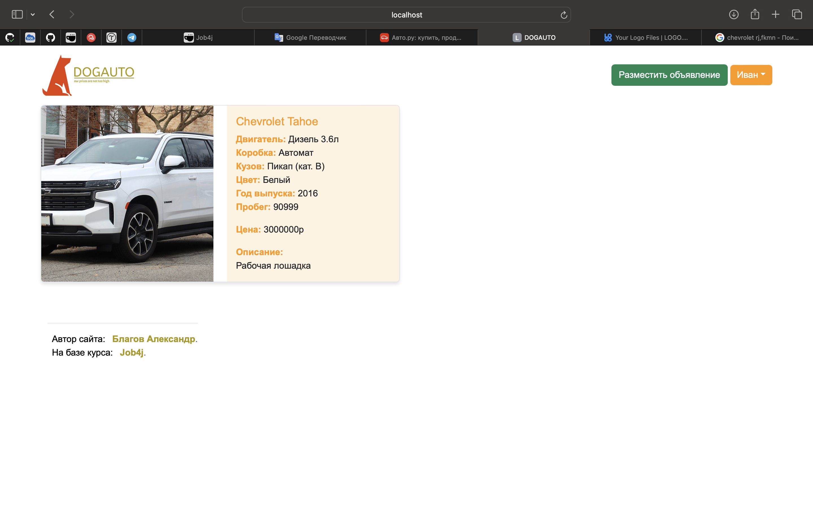
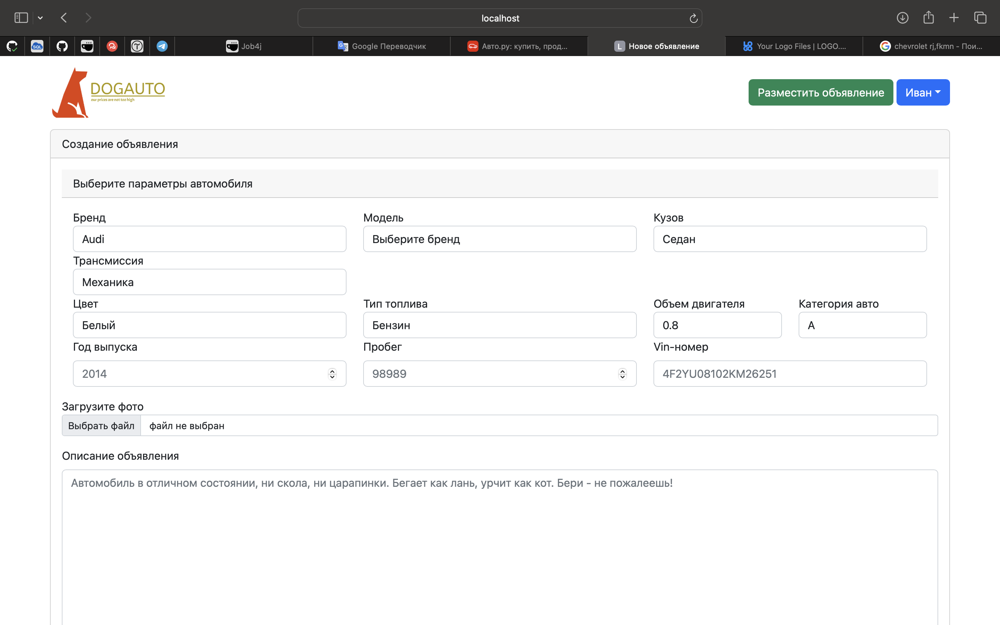
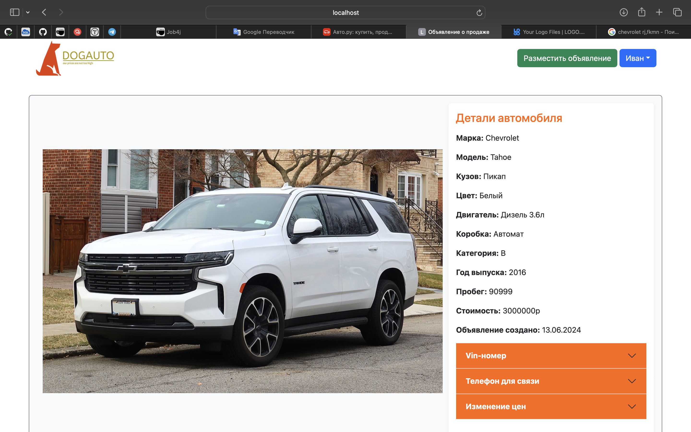
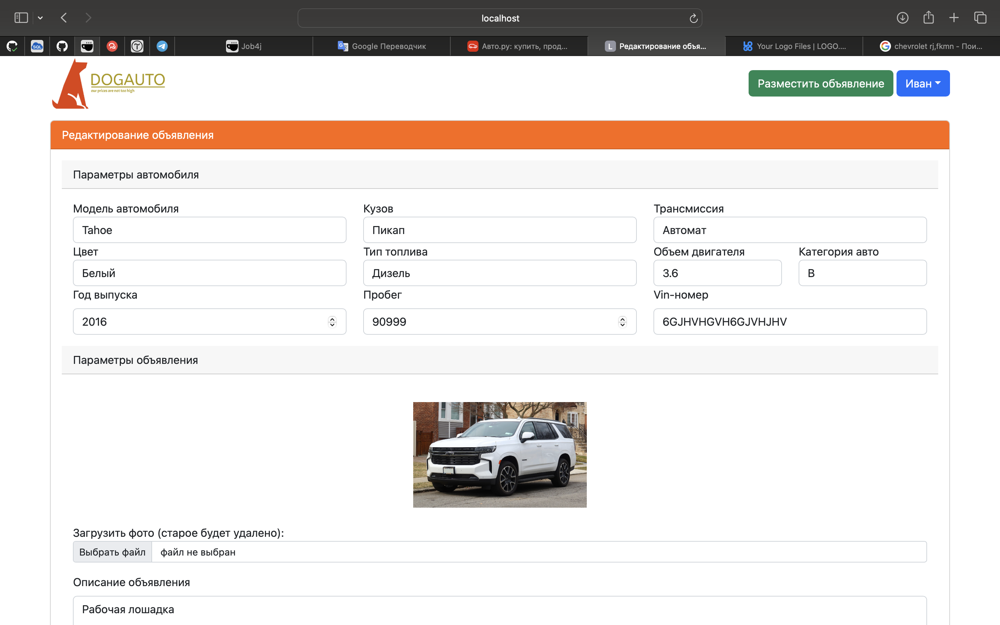

# job4j_cars

## Описание проекта

**job4j_cars** - это учебное веб-приложение для продажи автомобилей, 
разработанное на Java с использованием Spring Boot и Hibernate. 
Приложение позволяет пользователям создавать, редактировать 
и удалять объявления о продаже автомобилей, а также просматривать существующие объявления. 
Основная цель проекта - демонстрация навыков работы с Java, Spring Boot, Hibernate и принципами MVC. 
    ```

### Сборка и запуск

1. Склонируйте репозиторий:
    ```bash
    git clone https://github.com/Blagov13/job4j_cars.git
    cd job4j_cars
    ```

2. Соберите проект с помощью Maven:
    ```bash
    mvn clean install
    ```

3. Запустите приложение:
    ```bash
    mvn spring-boot:run
    ```

### Доступ к приложению

После успешного запуска приложение будет доступно по адресу: [http://localhost:8080](http://localhost:8080)

## Разработка

### Технологии
- Java 11
- Spring Boot
- Hibernate
- Thymeleaf
- PostgreSQL
- Maven

### Структура проекта

- `src/main/java` - исходный код приложения
- `src/main/resources` - ресурсы приложения
- `src/test` - модульные тесты

## Основные страницы

### Главная страница


### Создание объявления


### Просмотр объявления


### Редактирование объявления


## Контакты

Если у вас есть вопросы или предложения, пожалуйста, свяжитесь с нами:

- Автор проекта: [Blagov13](https://github.com/Blagov13)
- Электронная почта: blagov13rus@gmail.com
